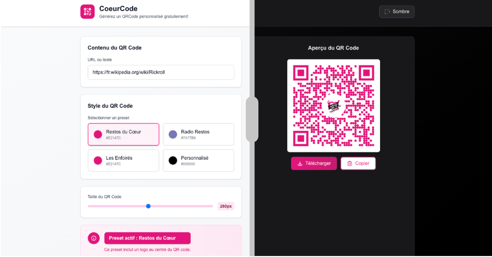

CoeurCode est une application Next.js permettant de générer des QR codes personnalisés avec des presets pour les Restos du Cœur, Radio Restos, Les Enfoirés, et plus encore.



## Fonctionnalités

- Génération de QR codes arrondis
- Choix de presets (couleur, logo)
- Mode personnalisé (couleur/logo)
- Téléchargement et copie du QR code
- Sélection de la taille
- Mode sombre

## Utilisation

### Installation

```bash
npm install
```

### Lancement en développement

```bash
npm run dev
```

### Lancement en production (Docker)

```bash
docker build -t coeurcode .
docker run -p 3000:3000 coeurcode
```

## Aller plus loin

### Ajouter un nouveau preset personnalisé

Pour ajouter un nouveau preset de QR code :

1. Ouvrez le fichier `src/types/preset.ts`.
2. Ajoutez un nouvel objet dans le tableau `presets` avec les propriétés suivantes :

```typescript
{
  id: 'mon-id', // identifiant unique
  name: 'Nom du preset', // affiché dans l’interface
  color: '#HEX', // couleur principale du QR code
  backgroundColor: '#HEX', // couleur de fond
  logoUrl: 'https://url/logo.png', // (optionnel) URL du logo
  logoWidth: 50, // (optionnel) largeur du logo
  logoHeight: 50 // (optionnel) hauteur du logo
}
```

3. Enregistrez le fichier. Le preset apparaîtra automatiquement dans l’interface.

Exemple :

```typescript
{
  id: 'nouveau-preset',
  name: 'Mon Nouveau Preset',
  color: '#FF9900',
  backgroundColor: '#FFFFFF',
  logoUrl: 'https://exemple.com/logo.png',
  logoWidth: 50,
  logoHeight: 50
}
```

## Licence

Projet sous licence GPLv3.
Développé par l'équipe du [Cloud du Cœur](https://cloudducoeur.org/).
